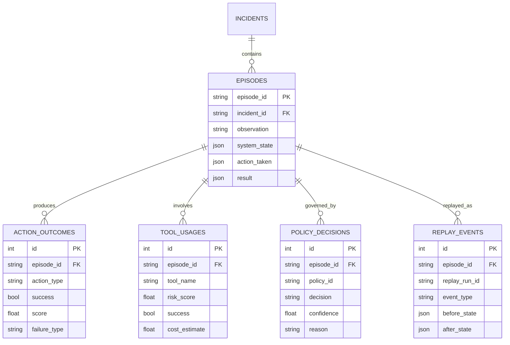

# Memory & Outcomes Schema

This document outlines the persistence layer for the Agent's Memory and Outcome systems. These schemas map to the core concepts in `backend/src/core/memory` and `backend/src/core/outcomes`.

## Directory Structure

All schemas are located in `backend/src/db/schemas/`.

- `episodic.py`: Incident and Episode snapshots.
- `outcomes.py`: Action results and scores.
- `tools.py`: Tool usage tracking, risk, and effectiveness.
- `policy.py`: Policy decisions and long-term policy performance.
- `replay.py`: Events generated during offline replay.
- `economics.py`: Cost budgets and action cost tracking.
- `memory_views.py`: Abstracted semantic memory (facts, patterns).

## Entity-Relationship Diagram

## Tables Description

### Episodic Memory (`episodic.py`)

- **Incident**: Represents a complete problem-solving session. Tracks the final outcome and resolution metrics.
- **Episode**: A single step within an incident (Observation -> Thought -> Action). Stores snapshots of the system state.

### Outcomes (`outcomes.py`)

- **ActionOutcome**: Explicitly tracks the result of every action. This is the source of truth for "what happened" and includes the numeric score (0-100) generated by the OutcomeScorer.

### Tools (`tools.py`)

- **ToolUsage**: Logs every tool execution. Key for calculating tool success rates, risk profiles, and blacklist enforcement. Includes latency and cost estimates.

### Policy (`policy.py`)

- **PolicyDecision**: Records every policy check made during an episode. Used for auditing why an action was allowed or blocked.
- **PolicyRecord**: Stores the long-term "health" of a policy rule (effectiveness, brittleness) derived from PolicyMemory.

### Replay (`replay.py`)

- **ReplayEvent**: Events generated when re-running episodes offline. These are used to update confidence scores without affecting live system state.

### Economics (`economics.py`)

- **CostBudget**: Manages spending limits per tenant.
- **ActionCost**: Detailed breakdown of compute, API, and human costs for actions.

### Semantic Memory (`memory_views.py`)

- **SemanticFact**: Abstracted knowledge derived from experiences.
- **ToolPattern**: Aggregated effectiveness of tools in specific contexts.
